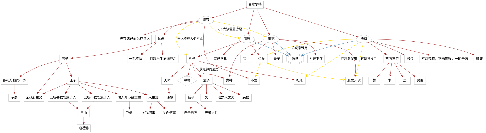

```dot
digraph show {
    // node
//rankdir = LR;
  node[shape="box" , fontname="DFKai-SB" fontsize=16 size="5,5" color="gray" distortion=.7]
  edge[ fontname="DFKai-SB" fontsize=15 fontcolor="black" color="brown" style="filled"]
 
儒家[shape="egg"]
道家[shape="egg"]
法家[shape="egg"]
墨家[shape="egg"]
救世[shape="doubleoctagon"]
中庸[shape="Mdiamond"]
百家争鸣->儒家->克己复礼
百家争鸣->墨家->兼爱非攻
百家争鸣->法家
法家->"不别亲疏，不殊贵贱，一断于法"
百家争鸣->道家
儒家->孔子->孟子->荀子
墨家->墨子
墨家->为天下谋
儒家->仁爱
道家->杨朱->老子->庄子
老子->善利万物而不争->示弱
老子->无政府主义
庄子->无政府主义
庄子->己所不欲勿施于人->自由
庄子->己所甚欲勿施于人->自由
自由->逍遥游
庄子->人生观->关你何事
人生观->关我何事
庄子->做人开心最重要->TVB
杨朱->一毛不拔
杨朱->且趣当生奚遑死后
法家->韩非
法家->两面三刀->奖惩
两面三刀->势
两面三刀->术
两面三刀->法
孔子->中庸
孔子->礼乐
孔子->鬼神[label="敬鬼神而远之"]
孔子->天命->使命
孟子->义
孟子->浩然大丈夫
孟子->民权
荀子->天道人性
荀子->君子自强
法家->君权
儒家->救世[arrowhead="vee" color ="steelblue"]
墨家->救世[arrowhead="vee" color ="steelblue"]
法家->救世[arrowhead="vee" color ="steelblue"]
墨家->鬼神
墨家->义士
道家->儒家[arrowhead="vee" color ="gold" label="天下大骇儒墨皆起"]
道家->孔子[arrowhead="vee" color ="gold" label="圣人不死大盗不止"]
道家->墨家[arrowhead="vee" color ="gold"  ]
道家->不爱
道家->先存诸己而后存诸人
法家->仁爱[arrowhead="vee" color ="gold" label="这玩意没用"]
法家->礼乐[arrowhead="vee" color ="gold" label="这玩意没用"]
法家->兼爱非攻[arrowhead="vee" color ="gold" label="这玩意没用"]
仁爱->兼爱非攻[arrowhead="vee" color ="gold"  dir="both"]
仁爱->不爱[arrowhead="vee" color ="gold"  dir="both"]
}
```

```mermaid
graph TD;
A-->B;
A-->C;
B-->D;
C-->D;
```
